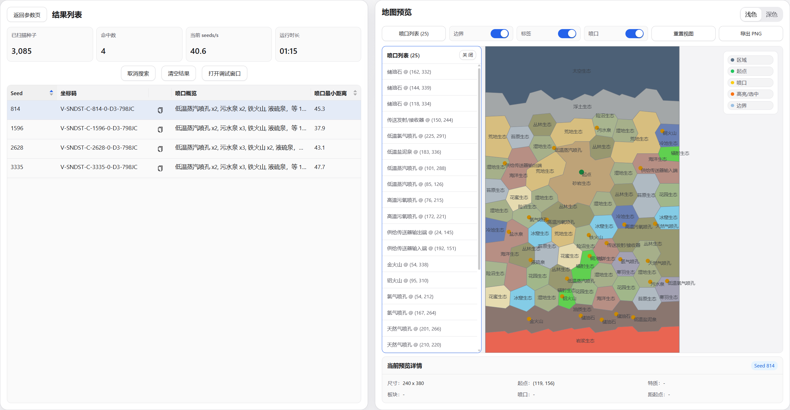

# oni-world-filter

> A Windows x64 desktop app for Oxygen Not Included world generation and seed filtering.

[](./README.zh-CN.md)




oni-world-filter is a local desktop tool for generating, searching, and previewing Oxygen Not Included world seeds. It reuses the C++ world-generation core and provides a Windows desktop interface through Tauri and React.

## Features

- Search usable seeds by world type and filter conditions.
- Review search results and preview the corresponding map information.
- Preview parameter details for all geysers.
- Switch preview focus between the primary and secondary asteroid.
- Generate detailed PDF reports.
- Show an optimistic estimated match probability and major bottleneck hints before searching.
- Run computation locally without relying on a remote search service.

## Tech Stack

| Area | Technology |
| --- | --- |
| Desktop UI | React 19, TypeScript, Vite |
| Desktop host | Tauri 2, Rust |
| World-generation core | C++23 |
| Build and packaging | CMake, MSVC x64, PowerShell, NSIS |

## Development Requirements

These requirements only apply when running from source, developing, or building release artifacts. End users using prebuilt artifacts do not need these development tools.

- Windows 10/11 x64
- Visual Studio C++ x64 Build Tools
- Rust toolchain
- Node.js
- `yarn` or `corepack`
- Tauri CLI

Install Tauri CLI:

```powershell
cargo install tauri-cli --version "^2.0.0"
```

## Quick Start

Start the desktop app in development mode:

```powershell
powershell -ExecutionPolicy Bypass -File .\scripts\dev-desktop.ps1
```

This script prepares the desktop frontend and local world-generation core, then starts the Tauri development environment.

## Build Release Artifacts

Generate `Setup + Portable-standard + Portable-offline`:

```powershell
powershell -ExecutionPolicy Bypass -File .\scripts\build-desktop.ps1 -Package all -Variant both
```

Build outputs are written to `out/release/desktop/<version>/`. The current release matrix is:

- `installer/oni-world-filter-<version>-Setup.exe`
- `portable-standard/oni-world-filter-<version>-Portable-standard.zip`
- `portable-offline/oni-world-filter-<version>-Portable-offline.zip`

Notes:

- `Setup` is the standard NSIS installer.
- `Portable-standard` is a no-install portable package that keeps runtime state under `.\data\` and does not write to `AppData`.
- `Portable-offline` adds a bundled WebView2 Fixed Runtime for offline machines.

Before building `Portable-offline`, set `ONI_WEBVIEW2_FIXED_RUNTIME_DIR` to an extracted WebView2 Fixed Runtime directory on the build machine.

Artifacts are unsigned by default, so Windows or security software may show additional prompts during launch or installation.

## License

This project is licensed under the [MIT License](./LICENSE).
