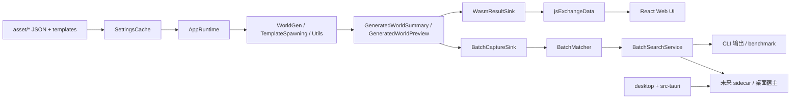

# oniWorldApp

> **基于 C++23 / WebAssembly 的《缺氧》世界生成模拟与筛种工具集。**

> 当前仓库同时维护三条产品线：浏览器预览版、Windows CLI 批量筛种链路，以及处于骨架阶段的 Tauri 桌面化宿主。


**oniWorldApp** 的核心目标，不是“重写一套简化版地图生成器”，而是尽可能复用《缺氧》现有的世界生成规则、资产配置与随机流程，在本地复现世界划分、子世界分配、模板放置与喷口计算。

在线预览入口：
[https://genrwoody.neocities.org/oni-map/index.html](https://genrwoody.neocities.org/oni-map/index.html)

## 功能特点

### 当前已实现

- **游戏同构世界生成**：复用 `asset/` 下的 cluster / world / subworld / trait / template 配置，直接驱动 C++ 生成核心。
- **浏览器地图预览**：Emscripten 将 C++ 编译为 Wasm，由 React 前端加载并绘制多边形区域、起点、喷口与特性。
- **CLI 批量筛种**：支持 `required / forbidden / distance` 三类规则，可批量扫描种子区间并输出命中摘要。
- **CPU 吞吐优化**：支持 Windows CPU 拓扑探测、线程策略候选、warmup 标定、自适应降并发与 benchmark 脚本。
- **共享运行时抽象**：`AppRuntime + ResultSink` 将 Wasm 输出与批量筛种数据捕获解耦，便于后续桌面化复用。
- **原生测试与文档**：`tests/native` 已覆盖筛选配置、匹配逻辑与搜索服务 smoke；`llmdoc/` 已沉淀架构与配置文档。

### 规划中

- **桌面应用主线**：`desktop/` + `src-tauri/` 已完成 React + Tauri 2 最小宿主骨架，但筛种与预览能力尚未接入桌面主界面。
- **桌面侧 sidecar 化**：已有明确的 Tauri 重构计划，目标是把现有 CLI/批量筛种能力收敛为桌面可用的本地服务链路。
- **待补文档层**：按当前规划，后续还会补 `devdoc/v0.0.3/基于句尾胶囊的文本标准化与句末标点可执行方案.md`。该文件目前尚不存在于仓库中，README 仅将其视为后续文档入口，不把它描述为现有能力。

## 产品形态

| 形态 | 当前状态 | 主要入口 | 适用场景 |
|------|----------|----------|----------|
| **WebAssembly 浏览器版** | 可用 | `src/index.tsx` + `src/main.cpp` | 单种子地图预览、交互式查看 |
| **Windows CLI 批量筛种** | 可用 | `src/main.cpp --filter` | 大范围种子扫描、规则筛选、性能 benchmark |
| **Tauri 桌面版** | 骨架阶段 | `desktop/` + `src-tauri/` | 未来桌面主产品形态 |

当前如果目标是**高效筛种**，应优先使用 CLI；
当前如果目标是**查看单个世界的区域和喷口布局**，应优先使用 Web 版；
当前桌面端更适合作为开发中的宿主骨架，而不是成熟交付物。

## 系统要求

### 基础环境

- **操作系统**：Windows 10/11
- **构建工具**：CMake 3.20+、Ninja、Python、Node.js、Yarn
- **C++ 工具链**：
  - WebAssembly 目标：Emscripten SDK
  - CLI / 原生测试：Pixi 拉起的 MinGW GCC，或本地 MSVC

### 桌面端额外要求

- **Rust toolchain**
- **Tauri CLI**：`cargo install tauri-cli --version "^2.0.0"`

## 快速开始

### 1. 浏览器版（WASM + React）

构建 release 版本：

```powershell
cmake --preset wasm-release
cmake --build out/build/wasm-release
yarn install
yarn run build
```

构建完成后，前端产物位于 `out/html/`。

开发模式：

```powershell
cmake --preset wasm-debug
cmake --build out/build/wasm-debug
yarn install
yarn run start
```

### 2. CLI 批量筛种（Pixi + MinGW）

安装依赖并构建：

```powershell
pixi install
pixi run build
```

运行筛种：

```powershell
out\build\mingw-release\oniWorldApp.exe --filter .\filter.json
```

常用命令：

```powershell
out\build\mingw-release\oniWorldApp.exe --help
out\build\mingw-release\oniWorldApp.exe --list-geysers
out\build\mingw-release\oniWorldApp.exe --list-worlds
```

### 3. 桌面端骨架（Tauri 2 + React）

开发模式：

```powershell
powershell -ExecutionPolicy Bypass -File .\scripts\dev-desktop.ps1
```

构建桌面壳：

```powershell
powershell -ExecutionPolicy Bypass -File .\scripts\build-desktop.ps1
```

需要明确的是：**当前桌面端只完成了窗口与占位界面骨架，业务能力尚未接线**。

## 技术栈

### 核心生成引擎

- **C++23**
- **Clipper**：多边形并集与裁剪
- **jsoncpp**：JSON 解析
- **miniz**：资源打包与压缩

### Web 路径

- **Emscripten**：C++ -> Wasm
- **React 19 + TypeScript**
- **Webpack 5**
- **Bootstrap 5 / React-Bootstrap**

### CLI / 性能链路

- **Pixi**：Windows 下的 MinGW / CMake / Python 环境分发
- **自研 Batch 模块**：配置解析、规则匹配、线程调度、吞吐优化

### 桌面化路径

- **Tauri 2**
- **Rust**
- **Vite + React 19 + TypeScript**

## 架构概览



这个仓库的关键点不是“前后端分层”，而是**同一套 C++ 世界生成内核被多种入口复用**：

1. `asset/` 提供游戏配置与模板资源；
2. `SettingsCache` 负责读取并缓存配置；
3. `AppRuntime` 统一编排种子初始化、世界生成与结果构造；
4. 结果再通过不同的 `ResultSink` 落到 Wasm 前端或 CLI 批量筛种链路。

## 核心架构

### 1. 共享运行时：`AppRuntime + ResultSink`

`src/App/` 是当前仓库最值得关注的一层：

- `AppRuntime` 负责初始化资源、解析坐标码、组织世界生成并输出 summary / preview。
- `ResultSink` 是统一输出抽象，区分“资源请求”和“生成结果回调”。
- `WasmResultSink` 负责兼容历史 `jsExchangeData()` 桥接。
- `BatchCaptureSink` 负责在 CLI 批量模式下抓取轻量 summary，不再依赖浏览器桥接协议。

这层的意义在于把**核心生成逻辑**与**运行入口**拆开，为后续桌面 sidecar 化做准备。

### 2. 浏览器路径：React 动态加载 Wasm

Web 路径并不是静态塞一个 `.wasm` 文件就结束，而是分成三步：

1. `src/index.tsx` 根据当前模式动态导入 `out/build/wasm-*/src/WasmFiles`。
2. 前端先拉取 `data.bin` 和 `wasm.bin`，再注入 Emscripten 生成的 launcher 脚本。
3. C++ 侧通过 `jsExchangeData()` 回推世界尺寸、起点、trait、喷口和多边形，前端据此更新 `Module.worlds` 并绘制画布。

因此浏览器版的核心不是 REST API，而是**Wasm 内存 + JS bridge**。

### 3. CLI 路径：批量筛种服务化

当前最成熟的“生产力路径”其实是 CLI 批量筛种链路：

1. `main()` 解析 `--filter`。
2. `Batch::LoadFilterConfig()` 读取 `filter.json` 并返回结构化错误。
3. `main.cpp` 根据 CPU 配置生成线程策略与运行参数。
4. `BatchSearchService::Run()` 负责 worker 调度、chunk 分发、吞吐采样和事件回调。
5. 每个 seed 通过 `AppRuntime + BatchCaptureSink` 生成轻量结果，再由 `BatchMatcher` 依次执行 forbidden / required / distance 匹配。

这条链路已经具备明显的“服务层”特征，只是当前宿主还是 CLI。

### 4. 桌面路径：宿主骨架已在，业务尚未接入

桌面端当前状态需要写得非常明确：

- `desktop/` 已有 Vite + React 19 应用骨架；
- `src-tauri/` 已有 Tauri 2 Rust 宿主与打包配置；
- `scripts/dev-desktop.ps1` / `scripts/build-desktop.ps1` 已可拉起桌面开发/构建命令；
- 但 `src-tauri/src/main.rs` 目前只有最小窗口启动逻辑；
- `desktop/src/app/App.tsx` 仍是参数区 / 结果区 / 预览区的占位页面。

也就是说，**桌面化方向已经开始落地，但还没有形成可用业务闭环**。

## 世界生成算法主链路

仓库最核心的算法，在 `src/WorldGen.cpp` 与 `src/TemplateSpawning.cpp`：

1. **坐标码解析与特性准备**
   - 解析 cluster、seed、mixing 与 DLC 状态。
   - 根据规则选择世界特性，并对 world/subworld 配置做增量修正。
2. **第一级划分：Overworld**
   - 先在世界矩形内采样种子点。
   - 再用 Voronoi 或 Power Diagram 把世界切成大区域。
   - 对每个区域传播距离标签，作为后续分配的空间约束。
3. **子世界分配**
   - 根据温度、标签、区域类型与过滤器链，把未定区域映射到具体 SubWorld。
   - 若布局方式是 PowerTree，还会在子世界权重确定后重新计算 Power Diagram。
4. **第二级划分：Children**
   - 在每个大区域内部继续递归采样与切分。
   - 给子节点分配 biome / feature，并按需要做 relax 与 swap。
5. **模板与喷口放置**
   - 先绘制世界边界禁区。
   - 再放起始基地、POI、喷口模板。
   - 最后根据模板位置与种子推导喷口类型。
6. **结果输出**
   - summary：世界尺寸、起点、trait、喷口
   - preview：在 summary 基础上追加多边形区域数据

算法实现细节可以继续阅读：

- `llmdoc/architecture/world-generation.md`
- `llmdoc/reference/data-structures.md`
- `llmdoc/reference/configuration.md`

## 目录结构

```text
oni_world_app-master/
├── src/                 C++ 核心、Wasm 入口、CLI 入口、Batch 服务
├── asset/               游戏 worldgen 资源、DLC 配置、模板与索引
├── desktop/             Tauri 桌面前端（Vite + React）
├── src-tauri/           Tauri 2 Rust 宿主
├── tests/               原生测试与协议夹具
├── scripts/             PowerShell 开发/构建/benchmark 脚本
├── llmdoc/              架构、配置与实现文档
└── devdoc/              开发专题文档（当前仅有 v0.0.1 CPU 优化专项）
```

## 配置与数据

### 世界生成配置

配置主要分布在：

- `asset/worldgen/`
- `asset/dlc/expansion1/worldgen/`
- `asset/dlc/dlc2/worldgen/`
- `asset/dlc/dlc4/worldgen/`
- `asset/templates/`

其中 `cluster -> world -> subworld -> biome / feature / trait / template` 的层级关系决定了最终地图的拓扑和内容。

### 批量筛种配置

CLI 默认读取 `filter.json`，核心字段包括：

- `worldType`
- `seedStart` / `seedEnd`
- `mixing`
- `required`
- `forbidden`
- `distance`
- `cpu`

当前 `cpu` 对象已经支持：

- `mode`
- `workers`
- `allowSmt`
- `allowLowPerf`
- `enableWarmup`
- `enableAdaptiveDown`
- `chunkSize`
- `progressInterval`

详细字段说明见：

- `llmdoc/guides/batch-filter.md`
- `llmdoc/reference/filter-config.md`

## 测试与验证

当前已接入的原生测试目标：

- `test_filter_config`
- `test_batch_matcher`
- `test_batch_search_smoke`
- `test_cpu_topology`
- `test_throughput_calibration`
- `test_adaptive_concurrency`
- `test_settings_cache`
- `test_sidecar_protocol`

运行方式：

```powershell
cmake --preset x64-debug
cmake --build out/build/x64-debug
ctest --test-dir out/build/x64-debug --output-on-failure
```

桌面壳的最小构建验证：

```powershell
yarn --cwd desktop build
powershell -ExecutionPolicy Bypass -File .\scripts\build-desktop.ps1
```

需要注意的是：当前自动化测试主要覆盖**筛种服务层**，还没有把完整世界生成结果做成系统级 golden 测试。

## 文档导航

- `llmdoc/index.md`：总索引
- `llmdoc/overview/project.md`：项目概览与目录说明
- `llmdoc/architecture/world-generation.md`：世界生成算法详解
- `llmdoc/guides/batch-filter.md`：CLI 批量筛种指南
- `llmdoc/reference/configuration.md`：配置体系参考
- `llmdoc/reference/filter-config.md`：`filter.json` 参考
- `llmdoc/decisions/2026-04-09-tauri-desktop-refactor-plan.md`：桌面化实施计划

## 当前边界与后续方向

当前仓库有几个边界需要明确：

- **Web 版强在可视化，不强在批量筛种**：浏览器版适合看单个种子，不适合承担高吞吐搜索。
- **CLI 强在吞吐，不强在交互体验**：批量筛种目前最成熟，但仍然是命令行工作流。
- **桌面端是方向，不是现状**：桌面壳已起步，但还没有成为主交互入口。
- **`devdoc/v0.0.3/...` 仍未落地**：该文档层目前不存在，也没有对应实现代码；它应该在后续设计完成后再正式纳入系统文档。

如果后续继续推进，这个项目最自然的演进方向会是：

1. 保持 C++ 核心与配置层不动；
2. 把批量筛种链路抽成桌面端可调用的 sidecar；
3. 让 `desktop/` 承担参数编辑、结果列表与地图预览主界面；
4. 最终把 Web 版降级为轻量预览工具，或仅作为 legacy 路径保留。

## License

本项目采用 [MIT License](./LICENSE)。

第三方库及其许可证见：

- `3rdparty/README.md`

同时，本项目依赖并复用《缺氧》相关配置结构与世界生成概念，相关游戏与品牌归其原作者及发行方所有：

- [Klei Entertainment](https://www.klei.com/)
- [Oxygen Not Included](https://www.klei.com/games/oxygen-not-included)
